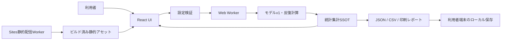
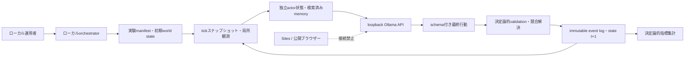

# アーキテクチャ

## 概要

本アプリはReact + TypeScript + Viteで構成したクライアントサイドの単一ページアプリです。設定、合成コホート、計算結果はブラウザー内だけで扱います。認証、データベース、外部API、分析SDK、サーバー保存、ブラウザー永続化はありません。

本書では、現在実装済みのこのブラウザーアプリを**Model v1**、ローカルで実行する別のLLM社会シミュレーションを**Agent World**と呼びます。両者は目的、実行環境、設定schema、結果schema、再現性、妥当性の主張が異なる別系統です。Agent Worldの決定論的coreとmetricsは`src/agent-world/`、local runnerは`local/`に分離します。実装blocker解消とローカルsmokeは完了しましたが、confirmatory実験はプロトコル凍結後の別承認まで利用可能とみなしません。Model v1やSites配信物へ暗黙に組み込みません。

## Model v1とAgent Worldの分離

| 項目 | Model v1 | Agent World |
|---|---|---|
| 状態 | 実装済み | v0.1 core/metrics＋local runner。ローカルsmoke済み、confirmatory未承認 |
| 実行場所 | ブラウザー/Web Worker、またはSitesで静的配信 | 運用者端末のローカルorchestrator＋ローカルOllama |
| 行動主体 | 固定数式で生成する合成学習者 | 独立状態を持つLLM actor |
| SSOT | `SimulationConfig`、モデルv1コード、`ExperimentResult` | versioned experiment manifest、決定論的world state、immutable event log |
| 外部通信 | なし | loopbackのOllama APIだけ。任意URL、クラウドLLM、Sitesからの接続は禁止 |
| 公開Sites | Model v1を実行 | Agent Worldは無効。説明用のread-only画面を表示しても、実行endpoint、Ollama接続、log取得、実行可能controlを提供しない |
| 再現単位 | model version＋32-bit Seed＋設定 | manifest＋model digest＋prompt/schema version＋全Seed＋保存済み最終応答/event log |
| 主張できる範囲 | 固定数式内のMonte Carlo比較 | agent相互作用の探索的比較。現実社会の予測ではない |

Agent Worldの最小データフローは次です。

1 tickは二相更新とします。全actorが同じ`state_t`のスナップショットから提案し、全提案が揃ってからエンジンが検証・競合解決して`state_t+1`を作ります。actorの評価順を世界更新順にしません。順序効果を研究対象にする場合だけ、schedulerをmanifestの実験変数として固定・記録します。

[OpenAI Agents SDKの公式orchestration guide](https://openai.github.io/openai-agents-js/guides/multi-agent/)はLLM orchestrationとcode orchestrationを区別し、code方式は速度・費用・性能をより決定的かつ予測可能にすると説明しています。Agent Worldはこのcode orchestrationを採用します。manager、handoff、agents-as-toolsは会話workflow向けであり、tick scheduling、state mutation、condition割当、評価には採用しません。

Agent World v1のactorは人名、人口属性、実在個人personaを持たず、安定ID、紙/電子適性、adaptability、social susceptibility、resource constraint、channel、bounded memoryという行動関連のtyped stateだけを持ちます。観測範囲はworld engineがnetworkとconditionから決めます。LLMはworld stateを直接変更せず、許可された有限action schemaの提案だけを返します。tool callingを採用する場合も、読み取り専用の許可済みsimulation toolに限定し、ファイル、shell、network、デプロイ操作を与えません。

memoryはmanifestで上限を固定し、conditionが許可する場合だけ入力します。将来reflectionや検索rankingを追加する場合は別のversioned submodelとablationとしてODDを更新します。Ollamaの`thinking`またはchain-of-thoughtは保存・画面表示・評価入力に使いません。監査ログには、versioned prompt/input、最終の構造化行動、外部へ観測可能な発話、validation結果、state差分だけを保存します。

## コンポーネント

### UI

`src/App.tsx`が設定、実行状態、前回完了結果、表示タブを管理します。初期表示は既定設定で同期計算した1試行結果です。設定変更後は結果をstaleとして示し、明示的な再実行が必要です。

UIが提供する主な操作は次です。

- シナリオと環境パラメータの変更
- 学習者数、構成比、成功閾値、32-bit Seed、試行回数の変更
- Worker実行、進捗表示、中止
- 方式比較、反復レポート、感度分析プリセット
- JSON、2種類のCSV、印刷/PDF出力

### 設定検証

`src/simulation/config.ts`がモデルv1の既定値と入力制約を持ちます。学習者数は10〜10,000、反復数は1/10/100/1,000、Seedはunsigned 32-bit、閾値と環境値は0〜1、構成比合計は100です。

### 合成コホートと乱数

- `src/simulation/random.ts`: `pure-rand`の`xoroshiro128plus`を初期化し、`jump()`で反復ごとの独立ストリームを導出
- `src/simulation/cohort.ts`: 最大剰余法で学習者タイプの整数人数を決め、適性と学習基礎力を生成
- `src/simulation/trial.ts`: 同じ学習者について紙、電子、紙＋電子のスコアと試行指標を計算

各反復は異なる合成コホートを使います。同一反復内の3方式は同じコホートを使うため、方式間差はpaired comparisonです。

### 反復と統計集計

`src/simulation/experiment.ts`が反復を実行し、方式別要約、方式間差、累積平均を一つの`ExperimentResult`へまとめます。`src/simulation/statistics.ts`は平均、標本標準偏差、Student tによる平均の95%区間、Hyndman–Fan type 7による中央95%試行範囲を計算します。

`ExperimentResult`が画面、グラフ、表、JSON、CSVの共有SSOTです。型契約は`src/types/model.ts`にあります。

### Web Worker

`src/workers/simulation.worker.ts`が反復計算をメインスレッドから分離します。メインスレッドは検証済み設定を送信し、Workerは進捗、完了結果、エラーを返します。中止時はWorkerをterminateし、未完了結果を採用せず、前回完了結果を保持します。

### レポート

`src/simulation/report.ts`が`ExperimentResult`から次を生成します。

- 再現情報と限界を含むschema version 1.0.0のJSON artifact
- UTF-8 BOM付きの方式別・paired差集計CSV
- UTF-8 BOM付きの試行単位CSV

自由入力文字列をレポートへ取り込まず、設定値、固定ラベル、結果、モデルメタデータを出力します。ファイルはブラウザーのBlob URLから利用者端末へ保存されます。

### Sites配信

`npm run build`はViteのクライアント成果物を生成し、`scripts/prepare-sites-build.mjs`が次を揃えます。

- `dist/client/index.html`
- `dist/server/index.js`
- `dist/.openai/hosting.json`

`worker/index.js`はSitesの静的アセットを配信します。不明なHTML向けGET/HEADだけを`index.html`へフォールバックし、API形式の要求や書き込み要求は404のまま返します。現在の`.openai/hosting.json`にはD1/R2 bindingがなく、デプロイは保留中です。初回デプロイはprivate-by-defaultです。

## 外部状態への影響

ローカル実行では、依存関係導入とビルド成果物を除き外部状態を変更しません。アプリ操作はブラウザー内メモリだけを変え、明示的な出力操作だけが利用者端末へファイルを作成します。

Sitesへのversion保存、privateデプロイ、公開範囲変更は外部状態を変更する別工程です。各操作は対象version、影響、rollback、承認を確認して実行します。

Agent Worldでは、Ollama modelのpull、ローカルmodel cache、実験manifest、event log、集計artifactが運用者端末へ作成されます。model pullは容量・ライセンス・digestを提示して別承認を得ます。実験開始はGPU時間とローカル保存領域を消費しますが、外部ネットワーク状態を変更してはなりません。Agent World artifactをGit、Sites、Issue、PRへ載せる操作は実験実行とは別の外部共有承認を要します。

## 意図的な対象外

- 実測データの収集・取込・校正
- 認証、ユーザーアカウント、共同編集
- データベース、クラウド保存、同期
- Model v1からの外部API、LLM、分析・行動計測
- p値、因果推論、母集団推定、将来予測
- 大域感度分析、Sobol指標、モデルの外部検証
- Sites、公開ブラウザー、Cloudflare WorkerからローカルOllamaへ接続する経路
- Agent World actorへの一般shell、任意network、GitHub、Sites、端末ファイルの操作権限
- chain-of-thought、hidden reasoning、Ollama `thinking`フィールドの保存・公開
- Agent Worldの出力を、校正なしに実在する個人・集団の代理標本として扱うこと

## 検証境界

`npm run verify`が型、モデル、統計、UI、レポート、ビルド、Sites配信契約を検査します。社会科学的妥当性、説明の中立性、実ブラウザーの保存UI、視覚品質、公開環境のアクセス制御・レスポンスヘッダーは人間による確認が必要です。

`npm run verify`にAgent World core testを含めても、Model v1とAgent Worldは別のtest suite・claimとして結果を記録します。Agent Worldはworld transition、action schema、情報境界、control/ablation、event replayを検証します。LLM actorが人間らしいか、創発がpromptで誘導されていないか、実在集団へ一般化できるか、モデル間で頑健かは自動テストだけでは確認できません。

### 解消済みの実装blockerと残る研究gate

- Agent World用Vite proxyは`--mode agent --host 127.0.0.1`のときだけ有効です。通常のVite/Sites成果物はAgent API proxyを持たず、agent serverとOllamaを含む実行経路をloopbackへ限定しました。
- decision HTTP失敗はrule policyへfallbackせずterminal errorとしてrunへ伝播します。失敗runをcompleted、no-cascade、別conditionへ変換しません。
- UIのprimary判定は`metrics.assessEmergence`へ集約し、ODDで定義するcontinuity cascade thresholdとpaired risk comparisonを使います。AUCは探索的なsecondary visualizationに限定します。
- Ollama 0.32.14と`qwen3.5:9b-q4_K_M`でAgents SDK compatibility pass、citizen smoke 2.25秒、ブラウザーのstart/progress/cancelを確認しました。これはtransport、1 actor decision、制御経路の実装証拠であり、外的妥当性やconfirmatory結果の証拠ではありません。

confirmatory gateは引き続き閉じます。pilotで選択・調整したcascade threshold、paired-risk threshold、minimum pairsやpilot結果を本試験へ流用せず、pilot runをconfirmatory datasetから除外します。model digest、prompt/action schema、protocol/engine hash、Seed manifest、閾値、反復数、除外・停止規則を事前凍結し、方法論・security・operations ownerの別承認を得てから新しいconfirmatory runを開始します。

## 公式仕様・一次資料との対応

| 分類 | 参照 | 採否 |
|---|---|---|
| 既存機能 | [Ollama Chat API](https://docs.ollama.com/api/chat)、[Structured Outputs](https://docs.ollama.com/capabilities/structured-outputs)、[Tool calling](https://docs.ollama.com/capabilities/tool-calling) | loopback推論、JSON Schema付き最終行動、許可済みsimulation toolに採用 |
| 既存機能 | [OpenAI Agents SDK custom model provider](https://openai.github.io/openai-agents-js/guides/models/) | adapterを使う場合のagent run/output schemaに限定して採用可能。world orchestrationはコード側に保持 |
| 既存パターン | [Generative Agents原論文](https://arxiv.org/html/2304.03442) | bounded memoryとcomponent ablationの根拠に採用。reflection/planningはAgent World v1の必須機能にせず、全履歴投入も不採用 |
| 既存標準 | [ODD protocol](https://www.jasss.org/23/2/7.html) | entities/state/scales、process/scheduling、initialization、submodelsの記述標準に採用 |
| 自前実装 | world state、二相tick、観測filter、action validation、競合解決、event sourcing、決定論的指標 | Ollamaは会話生成を提供するが、実験の因果境界と状態完全性は提供しないため必要 |
| 不明 | RTX 5060 Ti 16GBでの最大context、actor数、tick数、wall-clock、bitwise再現性 | [Ollama context length](https://docs.ollama.com/context-length)とAPI計測値を使い、smokeで実測してから固定する |
| 不明 | Agents SDKとOllamaの全機能互換 | Ollamaは[OpenAI compatibility](https://docs.ollama.com/api/openai-compatibility)を提供し、SDKはcustom providerを提供するが、この組合せのend-to-end保証はない。Chat Completions相当の最小featureだけをcontract testする |
| 不採用 | 公開Sitesからlocalhost Ollamaへの直接接続 | 公式に支持された安全なホスト経路が確認できず、local-only境界とCORS/到達性を破るため |
| 不採用 | Agents SDKのremote tracing | local-only要件とCoT/機微入力の非送信境界に反するため、[公式Tracing guide](https://openai.github.io/openai-agents-js/guides/tracing/)に従いrun前に無効化する |
