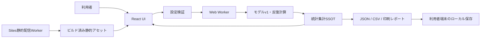

# アーキテクチャ

## 概要

本アプリはReact + TypeScript + Viteで構成したクライアントサイドの単一ページアプリです。設定、合成コホート、計算結果はブラウザー内だけで扱います。認証、データベース、外部API、分析SDK、サーバー保存、ブラウザー永続化はありません。

## コンポーネント

### UI

`src/App.tsx`が設定、実行状態、前回完了結果、表示タブを管理します。初期表示は既定設定で同期計算した1試行結果です。設定変更後は結果をstaleとして示し、明示的な再実行が必要です。

UIが提供する主な操作は次です。

- シナリオと環境パラメータの変更
- 学習者数、構成比、成功閾値、32-bit Seed、試行回数の変更
- Worker実行、進捗表示、中止
- 方式比較、反復レポート、感度分析プリセット
- JSON、2種類のCSV、印刷/PDF出力

### 設定検証

`src/simulation/config.ts`がモデルv1の既定値と入力制約を持ちます。学習者数は10〜10,000、反復数は1/10/100/1,000、Seedはunsigned 32-bit、閾値と環境値は0〜1、構成比合計は100です。

### 合成コホートと乱数

- `src/simulation/random.ts`: `pure-rand`の`xoroshiro128plus`を初期化し、`jump()`で反復ごとの独立ストリームを導出
- `src/simulation/cohort.ts`: 最大剰余法で学習者タイプの整数人数を決め、適性と学習基礎力を生成
- `src/simulation/trial.ts`: 同じ学習者について紙、電子、紙＋電子のスコアと試行指標を計算

各反復は異なる合成コホートを使います。同一反復内の3方式は同じコホートを使うため、方式間差はpaired comparisonです。

### 反復と統計集計

`src/simulation/experiment.ts`が反復を実行し、方式別要約、方式間差、累積平均を一つの`ExperimentResult`へまとめます。`src/simulation/statistics.ts`は平均、標本標準偏差、Student tによる平均の95%区間、Hyndman–Fan type 7による中央95%試行範囲を計算します。

`ExperimentResult`が画面、グラフ、表、JSON、CSVの共有SSOTです。型契約は`src/types/model.ts`にあります。

### Web Worker

`src/workers/simulation.worker.ts`が反復計算をメインスレッドから分離します。メインスレッドは検証済み設定を送信し、Workerは進捗、完了結果、エラーを返します。中止時はWorkerをterminateし、未完了結果を採用せず、前回完了結果を保持します。

### レポート

`src/simulation/report.ts`が`ExperimentResult`から次を生成します。

- 再現情報と限界を含むschema version 1.0.0のJSON artifact
- UTF-8 BOM付きの方式別・paired差集計CSV
- UTF-8 BOM付きの試行単位CSV

自由入力文字列をレポートへ取り込まず、設定値、固定ラベル、結果、モデルメタデータを出力します。ファイルはブラウザーのBlob URLから利用者端末へ保存されます。

### Sites配信

`npm run build`はViteのクライアント成果物を生成し、`scripts/prepare-sites-build.mjs`が次を揃えます。

- `dist/client/index.html`
- `dist/server/index.js`
- `dist/.openai/hosting.json`

`worker/index.js`はSitesの静的アセットを配信します。不明なHTML向けGET/HEADだけを`index.html`へフォールバックし、API形式の要求や書き込み要求は404のまま返します。現在の`.openai/hosting.json`にはD1/R2 bindingがなく、デプロイは保留中です。初回デプロイはprivate-by-defaultです。

## 外部状態への影響

ローカル実行では、依存関係導入とビルド成果物を除き外部状態を変更しません。アプリ操作はブラウザー内メモリだけを変え、明示的な出力操作だけが利用者端末へファイルを作成します。

Sitesへのversion保存、privateデプロイ、公開範囲変更は外部状態を変更する別工程です。各操作は対象version、影響、rollback、承認を確認して実行します。

## 意図的な対象外

- 実測データの収集・取込・校正
- 認証、ユーザーアカウント、共同編集
- データベース、クラウド保存、同期
- 外部API、LLM、分析・行動計測
- p値、因果推論、母集団推定、将来予測
- 大域感度分析、Sobol指標、モデルの外部検証

## 検証境界

`npm run verify`が型、モデル、統計、UI、レポート、ビルド、Sites配信契約を検査します。社会科学的妥当性、説明の中立性、実ブラウザーの保存UI、視覚品質、公開環境のアクセス制御・レスポンスヘッダーは人間による確認が必要です。
